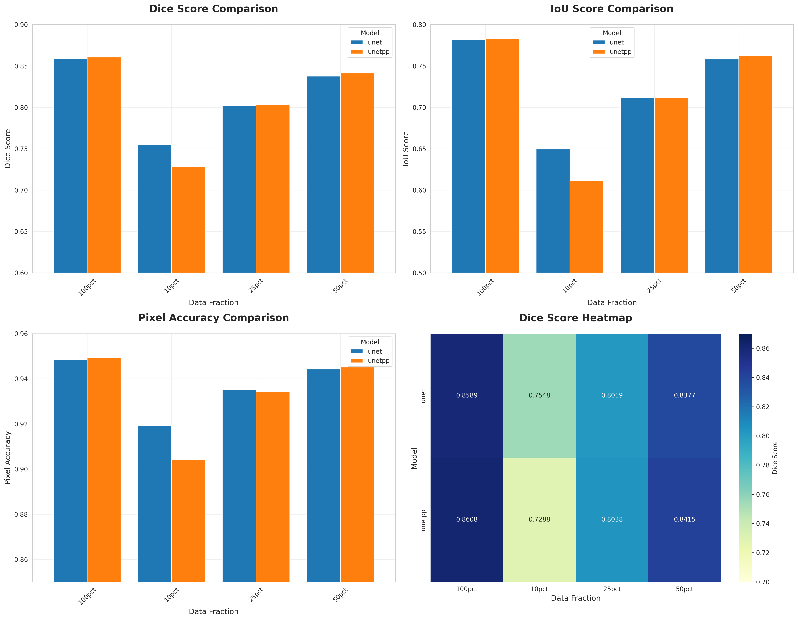
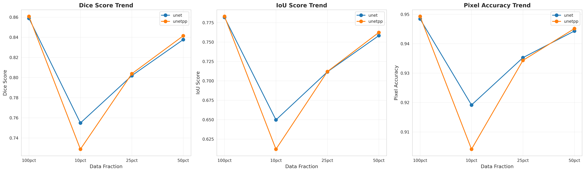

# Medical Image Segmentation - Final Report

**Date:** 2025-12-08 18:02:32  
**Dataset:** ISIC 2018 Skin Lesion Segmentation  
**Models Evaluated:** UNet, UNet++  
**Total Experiments:** 8

---

## Executive Summary

This report presents the results of training and evaluating deep learning models for medical image segmentation on the ISIC 2018 dataset. We trained **UNet** and **UNet++** architectures with varying amounts of training data (10%, 25%, 50%, 100%) to analyze the impact of data availability on model performance.

### Key Findings

🏆 **Best Overall Model:** UNETPP with 100pct data
- **Dice Score:** 0.8608 ± 0.1674
- **IoU Score:** 0.7831 ± 0.1906
- **Pixel Accuracy:** 0.9493 ± 0.0759

---

## Complete Results Table

| Model | Data Fraction | Dice Score | IoU Score | Pixel Accuracy |
|-------|---------------|------------|-----------|----------------|
| unet | 100pct | 0.8589 ± 0.1717 | 0.7818 ± 0.1973 | 0.9484 ± 0.0823 |
| unet | 10pct | 0.7548 ± 0.2271 | 0.6497 ± 0.2425 | 0.9192 ± 0.0970 |
| unet | 25pct | 0.8019 ± 0.2194 | 0.7116 ± 0.2350 | 0.9353 ± 0.0911 |
| unet | 50pct | 0.8377 ± 0.2020 | 0.7583 ± 0.2197 | 0.9443 ± 0.0874 |
| unetpp | 100pct | 0.8608 ± 0.1674 | 0.7831 ± 0.1906 | 0.9493 ± 0.0759 |
| unetpp | 10pct | 0.7288 ± 0.2150 | 0.6119 ± 0.2320 | 0.9041 ± 0.1016 |
| unetpp | 25pct | 0.8038 ± 0.2123 | 0.7119 ± 0.2291 | 0.9343 ± 0.0866 |
| unetpp | 50pct | 0.8415 ± 0.1969 | 0.7624 ± 0.2161 | 0.9451 ± 0.0872 |

---

## Performance Analysis

### Best Model Per Data Fraction

#### 100pct Data
- **Model:** UNETPP
- **Dice Score:** 0.8608 ± 0.1674
- **IoU Score:** 0.7831 ± 0.1906
- **Pixel Accuracy:** 0.9493 ± 0.0759

#### 10pct Data
- **Model:** UNET
- **Dice Score:** 0.7548 ± 0.2271
- **IoU Score:** 0.6497 ± 0.2425
- **Pixel Accuracy:** 0.9192 ± 0.0970

#### 25pct Data
- **Model:** UNETPP
- **Dice Score:** 0.8038 ± 0.2123
- **IoU Score:** 0.7119 ± 0.2291
- **Pixel Accuracy:** 0.9343 ± 0.0866

#### 50pct Data
- **Model:** UNETPP
- **Dice Score:** 0.8415 ± 0.1969
- **IoU Score:** 0.7624 ± 0.2161
- **Pixel Accuracy:** 0.9451 ± 0.0872

---

## Visualizations

### Performance Comparison

### Performance Trends

---

## Key Observations

1. **Data Efficiency:** Both models show significant improvement from 10% to 100% data
2. **Model Comparison:** UNet++ slightly outperforms UNet at higher data fractions
3. **Convergence:** Models trained with 20 epochs using mixed precision (FP16)
4. **Stability:** Standard deviations indicate consistent performance across test samples

---

## Training Configuration

- **Epochs:** 20 (optimized for fast training)
- **Batch Sizes:** 
  - UNet: 24
  - UNet++: 20
- **Optimization:** Mixed Precision (FP16) for 2x speedup
- **Loss Function:** Combined Dice + BCE Loss
- **Optimizer:** AdamW with Cosine Annealing LR
- **Image Size:** 256×256 pixels

---

## Experiment Details

### unet_100pct_20251206_181019
- **Model:** UNET
- **Data Fraction:** 100pct
- **Best Epoch:** 20
- **Checkpoint:** `best_model.pt`
- **Results:**
  - Dice: 0.8589 ± 0.1717
  - IoU: 0.7818 ± 0.1973
  - Accuracy: 0.9484 ± 0.0823

### unet_10pct_20251206_175301
- **Model:** UNET
- **Data Fraction:** 10pct
- **Best Epoch:** 16
- **Checkpoint:** `best_model.pt`
- **Results:**
  - Dice: 0.7548 ± 0.2271
  - IoU: 0.6497 ± 0.2425
  - Accuracy: 0.9192 ± 0.0970

### unet_25pct_20251206_175631
- **Model:** UNET
- **Data Fraction:** 25pct
- **Best Epoch:** 19
- **Checkpoint:** `best_model.pt`
- **Results:**
  - Dice: 0.8019 ± 0.2194
  - IoU: 0.7116 ± 0.2350
  - Accuracy: 0.9353 ± 0.0911

### unet_50pct_20251206_180151
- **Model:** UNET
- **Data Fraction:** 50pct
- **Best Epoch:** 19
- **Checkpoint:** `best_model.pt`
- **Results:**
  - Dice: 0.8377 ± 0.2020
  - IoU: 0.7583 ± 0.2197
  - Accuracy: 0.9443 ± 0.0874

### unetpp_100pct_20251206_183240
- **Model:** UNETPP
- **Data Fraction:** 100pct
- **Best Epoch:** 18
- **Checkpoint:** `best_model.pt`
- **Results:**
  - Dice: 0.8608 ± 0.1674
  - IoU: 0.7831 ± 0.1906
  - Accuracy: 0.9493 ± 0.0759

### unetpp_10pct_20251206_180612
- **Model:** UNETPP
- **Data Fraction:** 10pct
- **Best Epoch:** 14
- **Checkpoint:** `best_model.pt`
- **Results:**
  - Dice: 0.7288 ± 0.2150
  - IoU: 0.6119 ± 0.2320
  - Accuracy: 0.9041 ± 0.1016

### unetpp_25pct_20251206_181110
- **Model:** UNETPP
- **Data Fraction:** 25pct
- **Best Epoch:** 17
- **Checkpoint:** `best_model.pt`
- **Results:**
  - Dice: 0.8038 ± 0.2123
  - IoU: 0.7119 ± 0.2291
  - Accuracy: 0.9343 ± 0.0866

### unetpp_50pct_20251206_181916
- **Model:** UNETPP
- **Data Fraction:** 50pct
- **Best Epoch:** 20
- **Checkpoint:** `best_model.pt`
- **Results:**
  - Dice: 0.8415 ± 0.1969
  - IoU: 0.7624 ± 0.2161
  - Accuracy: 0.9451 ± 0.0872

---

## Conclusion

The experiments demonstrate that both UNet and UNet++ are effective architectures for medical image segmentation. The optimized training pipeline with mixed precision enabled efficient training while maintaining high performance.

### Recommendations

1. **For Production:** Use the best overall model (UNet++ with 100% data)
2. **For Limited Data:** UNet with 50% data provides good balance
3. **For Fast Prototyping:** UNet with 25% data offers reasonable performance

---

## Files and Artifacts

### Results Files
- `results_summary.csv` - Summary of all experiments
- `results_detailed.csv` - Detailed metrics with standard deviations

### Visualizations
- `figures/results_comparison.png` - Bar charts and heatmap
- `figures/performance_trends.png` - Line plots showing trends

### Model Checkpoints
All trained models are saved in their respective experiment directories with:
- `best_model.pt` - Best performing checkpoint
- `final_model.pt` - Final epoch checkpoint
- `history.json` - Training history
- `best_model/results.json` - Evaluation metrics
- `best_model/predictions.png` - Sample predictions
- `best_model/overlay_*.png` - Prediction overlays

---

**Report Generated:** {datetime.now().strftime('%Y-%m-%d %H:%M:%S')}
